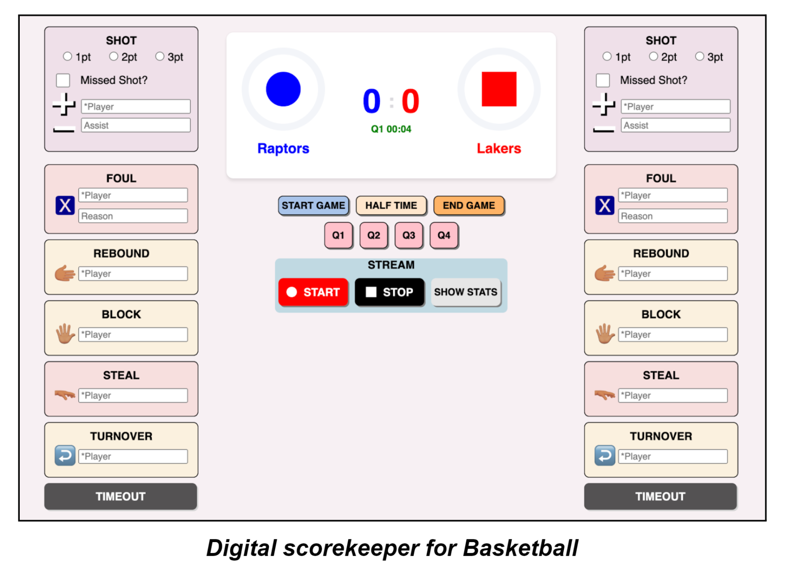
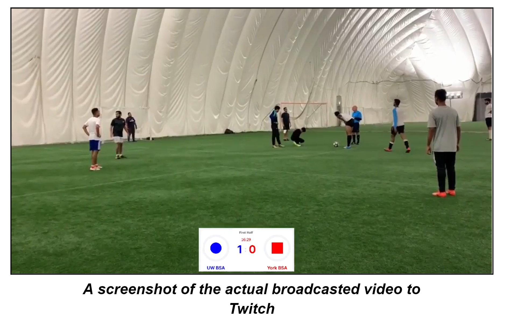
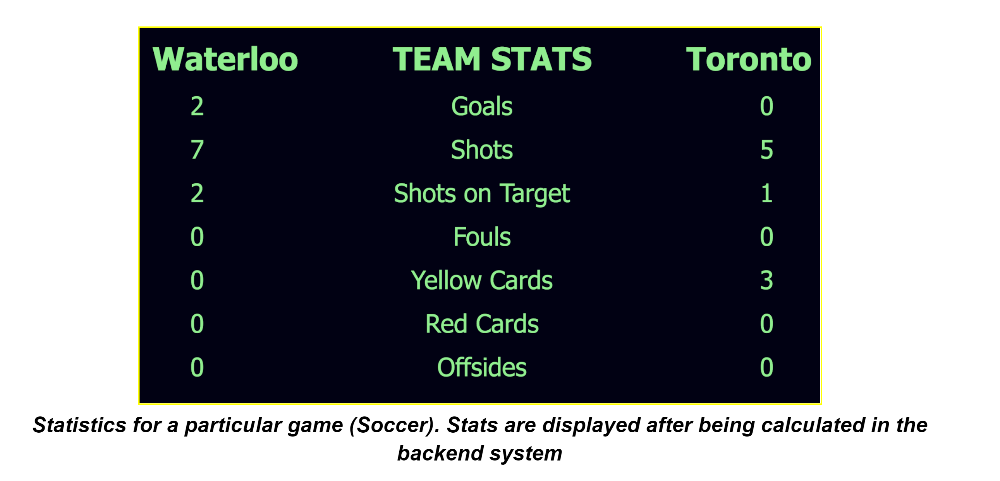
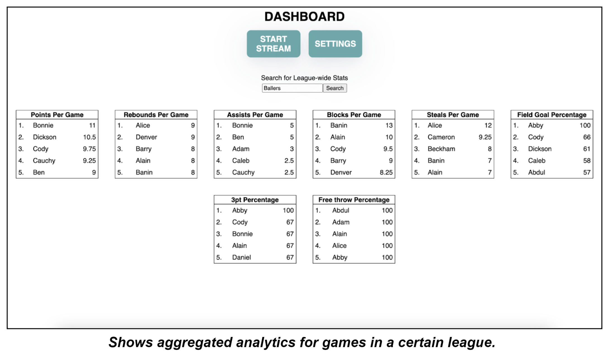
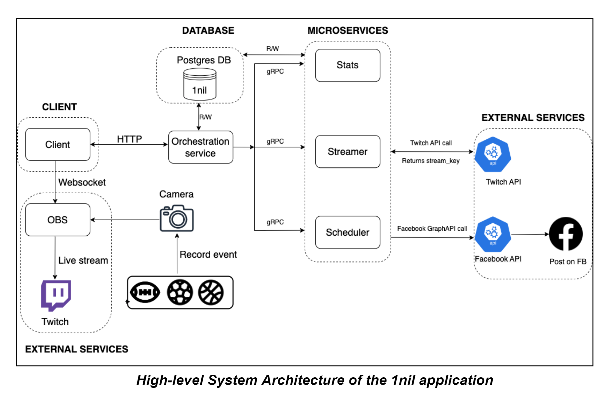

# 1nil⚽🏀🏈

1nil is a free broadcasting and analytics solution for minor and amateur sports leagues. It was created as part of the [Fourth Year Design Project (FYDP)](https://www.eng.uwaterloo.ca/2023-capstone-design/electrical-computer/), which is a degree requirement for Computer Engineering students at UWaterloo. This was a collaborative endeavour by [Iram](https://github.com/KnotScientific), [Siddharth](https://github.com/sid42), [Shreyas](https://github.com/Shreyas15srivatsa), [Banin](https://github.com/babrar) and [Madhur](https://github.com/madhur4444) 

## Features 
1nil is an affordable platform that enables clients to offer a comprehensive viewing and media consumption experience to fans by providing programmatic outlets for live sports information. Clients select the sport they wish to stream (Soccer, Basketball or American Football) and manually update the match scorecard using our user-friendly interface. Whenever the scorecard is updated (e.g., a goal in soccer or a three-pointer in basketball), 1nil automatically performs tasks like updating the scorecard overlays on live streams, scheduling social media posts, and calculating statistics. In major leagues, individuals are employed to manually perform these tasks. Our software platform, 1nil, is a desktop application that automates these processes, saving both time and money.

## Usage

To run the backend, with Docker on your system, run `make start`

Client instructions can be found at https://github.com/FYDP-1nil/client